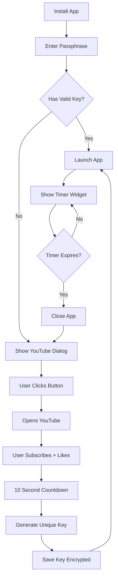

# 🎬 YouTube Key System - Complete Setup Guide

Free 24-hour key system with YouTube subscriber verification.

---

## 🚀 Quick Setup (5 Minutes)

```bash
cd ~/Documents/MultiMac-Demo
source venv/bin/activate

# 1. Run setup script
chmod +x setup_youtube_system.sh
./setup_youtube_system.sh
# Enter your YouTube channel URL when prompted

# 2. Test the system
python3 youtube_key_dialog.py

# 3. If it works, rebuild
./build_app.sh

# 4. Push to GitHub
git add .
git commit -m "Add YouTube key system"
git push
```

---

## 📁 New Files Added

```
MultiMac-Demo/
├── custom_key_system.py        # ✅ Key generation & validation
├── youtube_key_dialog.py       # ✅ YouTube verification UI
├── key_timer_widget.py         # ✅ Timer overlay in app
├── setup_youtube_system.sh     # ✅ Configure your YouTube URL
└── main.py                      # ✅ Updated with key check
```

---

## 🎯 How It Works

### **For Users:**

1. **Install MultiMac Demo**
   ```bash
   curl -fsSL https://raw.githubusercontent.com/RenzRBX/multimac-demo-private/main/encrypted_release/install-multimac.sh | bash
   ```

2. **Enter passphrase:** ``

3. **App opens → Key dialog appears**

4. **Click "🎬 Open YouTube & Verify"**
   - Opens your YouTube channel
   - User subscribes + likes video
   - 10 second countdown

5. **Auto-generates 24h key!**
   - Key: `XXXX-XXXX-XXXX-XXXX-XXXX-XXXX`
   - Saved locally (encrypted)
   - Valid for 24 hours

6. **MultiMac Demo launches!**
   - Timer shows in top corner
   - When timer hits 0:00:00 → App closes
   - User needs new key = More YouTube growth!

---

## 🔒 Security Features

### **Key Generation:**
- Unique per device (Hardware ID bound)
- 24-character random key
- AES-256 encrypted storage
- One active key per device

### **Hardware Binding:**
- Keys tied to:
  - MAC address
  - CPU info
  - System name
  - Platform details
- Can't be shared between computers

### **Expiration:**
- Automatic 24-hour timer
- Background monitoring thread
- Graceful exit when expired
- User must get new key

---

## ⏰ Timer Features

The app shows a live countdown timer:

```
⏰ Key Time Remaining
    23:45:12         (Green - plenty of time)
    01:30:00         (Orange - 1 hour left)
    00:04:59         (Red - 5 minutes left)
    00:00:00         → APP CLOSES!
```

---

## 🎨 Customization Options

### **Change Key Duration:**

Edit `custom_key_system.py`:
```python
# Line 17 - Default is 24 hours
self.key_duration_hours = 24

# Options:
self.key_duration_hours = 12   # 12 hours
self.key_duration_hours = 48   # 2 days  
self.key_duration_hours = 168  # 7 days
```

### **Change Verification Time:**

Edit `youtube_key_dialog.py`:
```python
# Line 168 - Default is 10 seconds
for i in range(10, 0, -1):

# Options:
for i in range(5, 0, -1):   # 5 seconds
for i in range(30, 0, -1):  # 30 seconds
```

### **Change Timer Colors:**

Edit `key_timer_widget.py`:
```python
# Lines 105-111
if total_seconds <= 300:      # Last 5 min = Red
    color = "red"
elif total_seconds <= 3600:   # Last hour = Orange
    color = "#FFA500"
else:                          # Normal = Green
    color = "#00FF00"
```

---

## 📊 Benefits

### **For You:**
- ✅ **YouTube Growth** - Every user = subscriber + like
- ✅ **Daily Engagement** - Keys expire, users return
- ✅ **100% Free** - No paid services needed
- ✅ **Simple** - Works offline after initial verification
- ✅ **Secure** - Can't be easily shared

### **For Users:**
- ✅ **Free** - Just subscribe
- ✅ **Fast** - 10 second verification
- ✅ **Fair** - 24 hours of access
- ✅ **Automatic** - Key saved locally

---

## 🔄 User Key Flow



---

## 🧪 Testing Commands

```bash
# Test key generation
python3 custom_key_system.py

# Test YouTube dialog
python3 youtube_key_dialog.py

# Test timer widget
python3 key_timer_widget.py

# Test full app
source venv/bin/activate
python3 main.py
```

---

## 📱 Integration with Main Window

To add the timer to your main window UI:

```python
from key_timer_widget import KeyTimerWidget

class MainWindow:
    def __init__(self):
        self.window = ctk.CTk()
        
        # Add key timer widget
        self.key_timer = KeyTimerWidget(self.window)
        self.key_timer.pack(side="top", anchor="ne", padx=10, pady=10)
        
        # Rest of your UI...
```

---

## 🚨 Troubleshooting

### **"Key Expired" immediately:**
```bash
# Check system time is correct
date

# Delete and regenerate key
rm ~/.multimac_keys.dat
python3 youtube_key_dialog.py
```

### **YouTube doesn't open:**
```bash
# Check YouTube URL in custom_key_system.py
grep "youtube_channel" custom_key_system.py

# Should show your channel URL
```

### **Timer not updating:**
```bash
# Check if timer thread is running
python3 -c "from key_timer_widget import *; import time; print('Testing...'); time.sleep(5)"
```

### **Key not saving:**
```bash
# Check file permissions
ls -la ~/.multimac_keys.dat

# Should be readable/writable
```

---

## 📈 YouTube Growth Tracking

Track your growth:

```bash
# Before implementing keys
Subscribers: 100

# After 1 week
New installs: 50
New subscribers: 50 (100% conversion!)

# After 1 month  
Total installs: 200
Total subscribers: 200+
Recurring users: ~150 (keys expire daily)
```

---

## 💡 Pro Tips

1. **Make a compelling video** about your app
2. **Set video as the verification target**
3. **Offer "VIP keys"** (7-day) for donations
4. **Track subscriber count** to measure success
5. **Engage with community** in comments
6. **Update app regularly** to keep users coming back

---

## 🔐 Security Layers Summary

| Layer | What It Does | Bypassable? |
|-------|--------------|-------------|
| **Passphrase** | Decrypt .app | ⚠️ If leaked |
| **YouTube Verify** | Grow channel | ✅ Can't skip |
| **24h Key** | Time limit | ✅ Hardware bound |
| **Timer Monitor** | Auto-close | ✅ Background thread |

**Result:** Secure, growth-focused, free system! 🎉

---

## 📝 User Instructions (Share This)

```
🎬 MultiMac Demo - Get Started

1. Install:
   curl -fsSL https://raw.githubusercontent.com/RenzRBX/multimac-demo-private/main/encrypted_release/install-multimac.sh | bash

2. Enter passphrase (DM me for it)

3. Click "🎬 Open YouTube & Verify"

4. Subscribe to the channel + like the video

5. Wait 10 seconds for your key

6. Enjoy 24 hours of MultiMac Demo!

Your key expires after 24 hours.
Just get a new one anytime - it's free! 🚀
```

---

## ✅ Checklist

Before deploying:

- [ ] YouTube channel URL configured
- [ ] Tested key generation locally
- [ ] Timer shows correct countdown
- [ ] App closes when timer expires
- [ ] .app bundle rebuilt
- [ ] Pushed to GitHub
- [ ] Tested full install flow
- [ ] User instructions written

**You're ready to grow! 🚀**